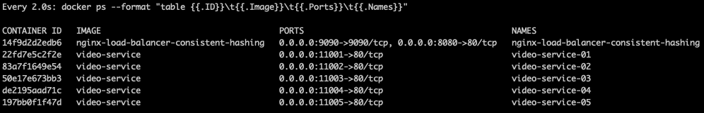
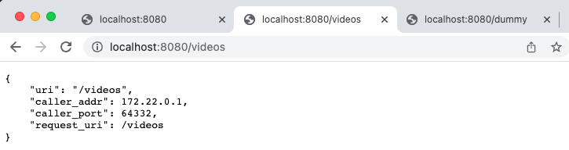
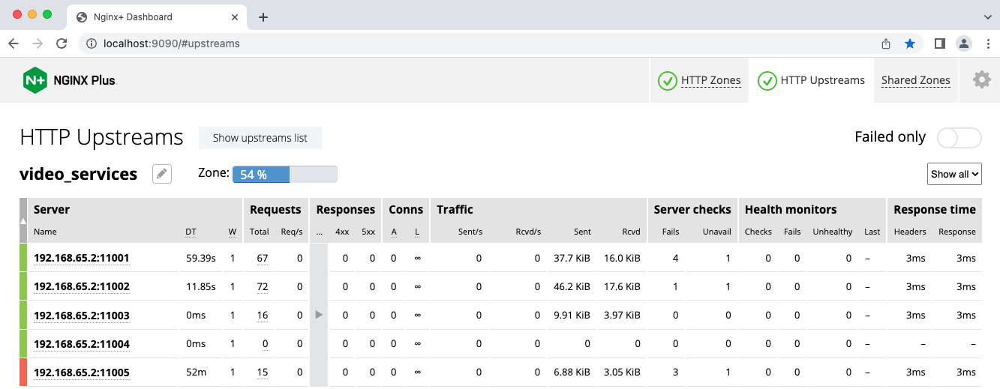

# nginx-consistent-hash

Example of NGINX Load Balancing (Consistent Hashing)

Load balancing across multiple application instances is a commonly used technique for optimizing resource utilization, maximizing throughput, reducing latency, and ensuring fault‑tolerant configurations.

This repo provides an example of how to configure a NGINX load balancer and test sample video services using the algorithm of consistent hashing.

## Consistent Hashing

**Consistent Hashing** is a distributed hashing scheme that operates independently of the number of servers or objects in a **distributed hash table** by assigning them a position on an **abstract circle, or hash ring**. This allows **servers and objects to scale** without affecting the overall system.

## Prerequisites

- [Install and Run Docker](https://docs.docker.com/engine/install/)

- [Download NGINX Plus license files](https://www.nginx.com/free-trial-request/), and copy them to `./docker/build-context/ssl/`

  ```
  nginx-repo.crt
  nginx-repo.key
  ```

## Getting Started

- Run a NGINX load balancer and 5 sample video servcies as containers:

  ```bash
  make start
  ```

- Check if the above containers are successfully started:

  ```bash
  make watch
  ```

  

- Request sample APIs:

  

- Check the status of load balancer:

  

  > **Note**:
  >
  > Try killing some of containers and restart them to see how the load balancer works based on consistent hashing algorithm.
  >
  > ```bash
  > docker kill video-service-05
  > curl localhost/videos
  > docker kill video-service-01
  > curl localhost/videos
  > curl localhost/dummy
  > make start
  > ```

- Stop containers and clean the images:

  ```bash
  make down
  make clean
  ```

## Consistent Hashing Configuration

```nginx
upstream video_services {
    zone video_services 64k;
    hash $request_uri consistent;
    server host.docker.internal:11001;
    server host.docker.internal:11002;
    server host.docker.internal:11003;
    server host.docker.internal:11004;
    server host.docker.internal:11005;
}
```

## References

- [NGINX: HTTP Load Balancing](https://docs.nginx.com/nginx/admin-guide/load-balancer/http-load-balancer/)
- [libketama - a consistent hashing algo for memcache clients](https://www.last.fm/user/RJ/journal/2007/04/10/rz_libketama_-_a_consistent_hashing_algo_for_memcache_clients)
- [WiKi: Consistent Hashing](https://en.wikipedia.org/wiki/Consistent_hashing)
- [GitHub: Ketama Consistent Hashing Library](https://github.com/RJ/ketama)
- [GitHub: NGINX Ketama Consistent Hashing Module](https://github.com/flygoast/ngx_http_upstream_ketama_chash)
- [A Guide to Consistent Hashing](https://www.toptal.com/big-data/consistent-hashing)
